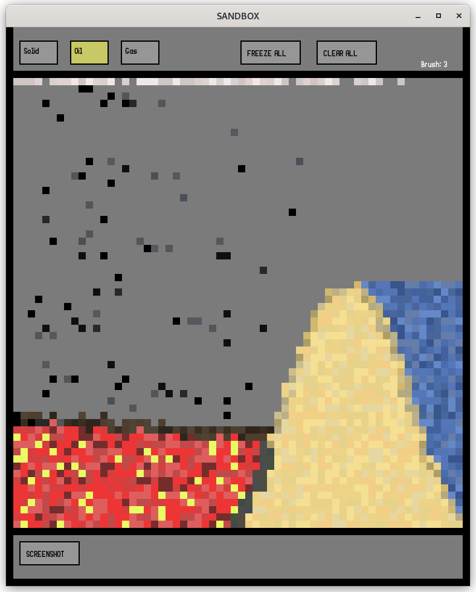

A sandbox game using C++ and SFML

Built with gcc (12.2.0) and CMake (3.25.1) on Debian 

Use Left Mouse Button to place particles and choose particle type
Use Right Mouse Button to remove particle
Use    Z and X to scale down/up (also possible by grabbing window edges)
Use Down and Up to regulate brush size

1: extract anywhere (avoid non-latin letters in the path)

2:

VSCode:
Make sure that CMake and C++ extensions are installed
Open the project directory from within the app (ctrl+k ctrl+o) and build using gcc 
Run with CTRL+SHIFT+F5

Linux:

Make your way into the project directory
Run this command while inside the directory:

```sh
cmake CMakeLists.txt
```

then run the app via 
```sh
./build/sandbox
```

Example:


